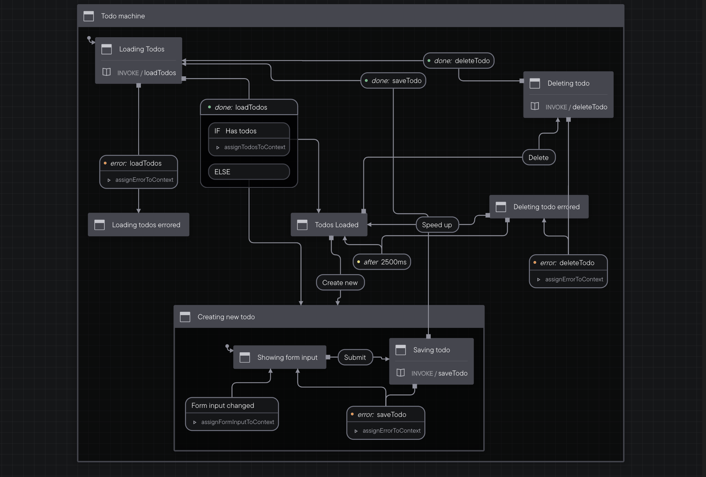

# Todo

A to-do list app using XState and the Stately tools.

    

## Features

- setting up a basic dev environment.
- building a simple machine with XState.
- using the visual editor integrated with the [VS Code extension](https://marketplace.visualstudio.com/items?itemName=statelyai.stately-vscode) to build a state machine.
- adding events as a union type, understanding actions and using typegen.
- invoking services, using onDone and onError to handle async functions.
- using context and assigning actions.
- generating nested states and self transitions to handle a form.
- adding and deleting a todo item.
- using after to manage timeouts.
- adding if/else logic with guards.

Based on [The Official Beginner’s Guide to XState in React](https://www.youtube.com/playlist?list=PLvWgkXBB3dd4ocSi17y1JmMmz7S5cV8vI) by Matt Pocock - Stately (2022).
