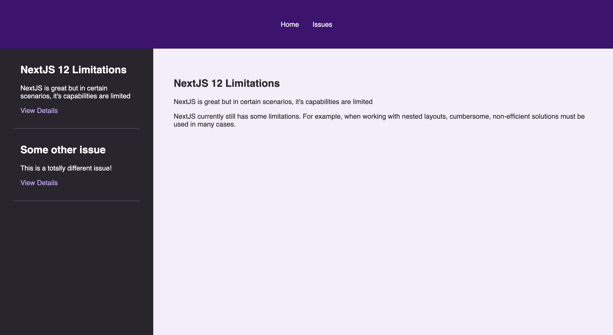

# NextJS 13 - Demo

A quick intro to NextJS 13 features.

    

## Features

- handling pages in the app folder.
- using a global layout and nested layouts.
- setting up Prisma with a local database.
- fetching data with Prisma Client.
- using async/await with React Server Components.
- adding a loading screen.
- adding an error screen.

Based on [NextJS 13 - First Look at the /app Folder & Complete Demo](https://www.youtube.com/watch?v=bDDuLuCqHg0) by Maximilian Schwarzmüller - Academind (2022).
