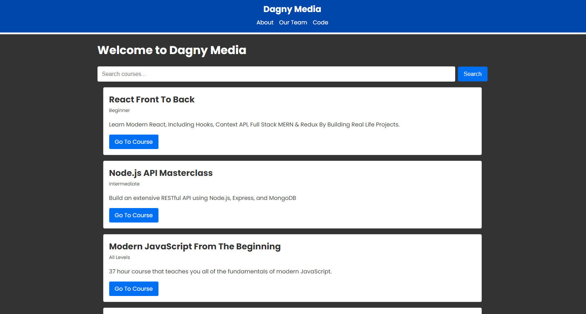

# Dagny Media

A quick intro to NextJS 13 features.

<!-- 

    

 -->

## Features

- using the routing system and creating nested routes.
- customizing the layout, using the Metadata API and Google Fonts.
- creating a header and discovering React Server Components.
- fetching data from GitHub API.
- adding a custom loading spinner.

Based on [Next.js 13 Crash Course | App Directory, React Server Components & More](https://www.youtube.com/watch?v=Y6KDk5iyrYE) by Brad Traversy - Traversy Media (2023).
