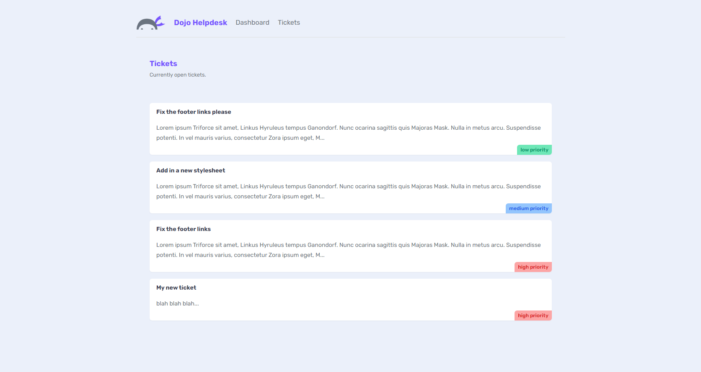

# Dojo Helpdesk

A quick intro to NextJS 13 features, using TailwindCSS.

<!-- 

    

 -->

## Features

- setting up the project.
- creating routes.
- building a layout with components.
- handling styles, fonts, and images.

Based on [Next.js 13 Crash Course](https://www.youtube.com/playlist?list=PL4cUxeGkcC9jZIVqmy_QhfQdi6mzQvJnT) by Shaun Pelling - Net Ninja (2023).
