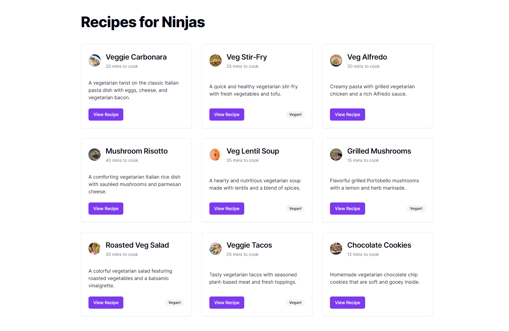

# Ninja Recipes

A quick intro to shadcn/ui, using TypeScript and TailwindCSS.

<!-- 

    

 -->

## Features

- setting up the project.
- fetching data, using a locally hosted JSON server.
- creating a Card component.
- using Button, Badge, and Avatar.

Based on [Shadcn UI Crash Course](https://www.youtube.com/playlist?list=PL4cUxeGkcC9h1NXLUuiAQ7c4UtdEInqma) by Shaun Pelling - Net Ninja (2023).
