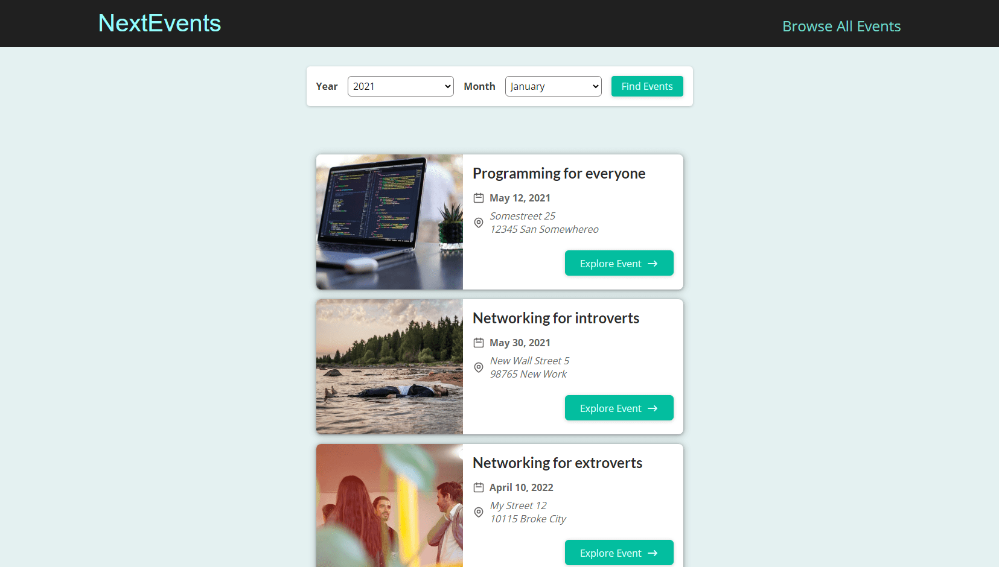
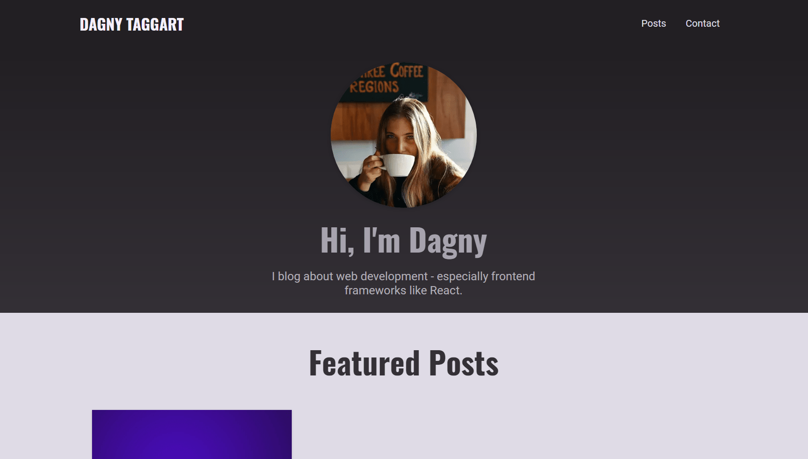
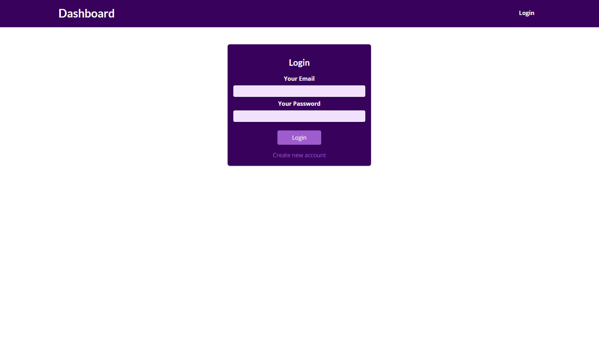
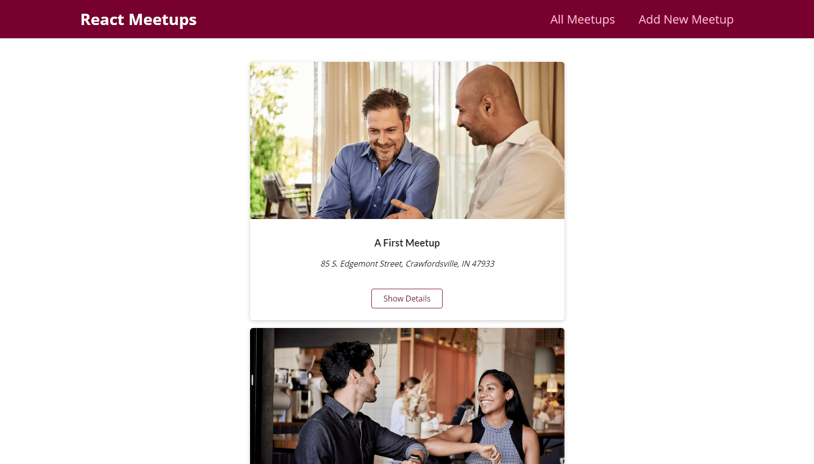
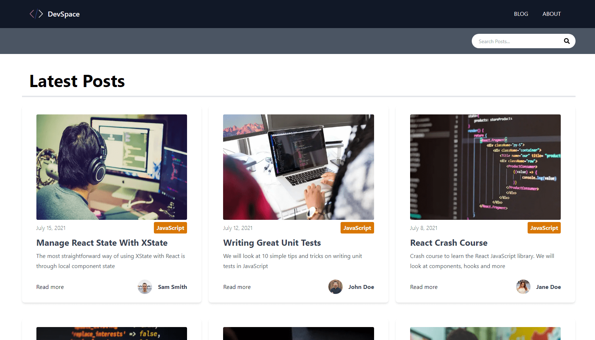
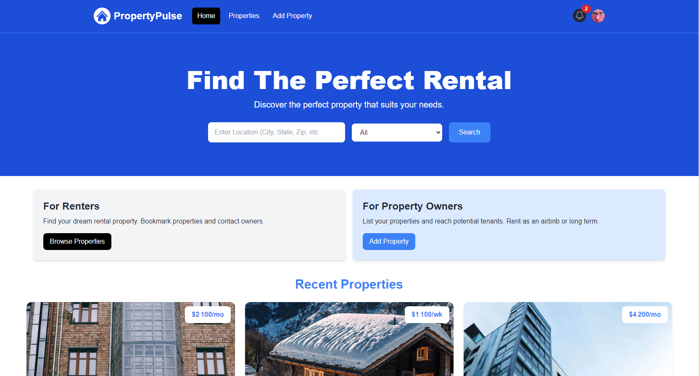

# Next.js Projects

7 projects to understand Next.js core concepts, using MongoDB, Firebase and NextAuth.js.

| #   | Project                              | Description                                                                                       |
| --- | ------------------------------------ | ------------------------------------------------------------------------------------------------- |
| 01  | [**NextEvents**](#nextevents)        | A social networking site using Next.js, MongoDB and Firebase.                                     |
| 02  | [**Blog**](#blog)                    | A complete app example with a blog using Next.js, MongoDB, Markdown and React Syntax Highlighter. |
| 03  | [**Dashboard**](#dashboard)          | A very simple dashboard to understand authentication with NextAuth.js.                            |
| 04  | [**React Meetups**](#reactmeetups)   | Another social networking site to summarize Next.js core concepts.                                |
| 05  | [**DJ Events**](#djevents)           | A music event website using Strapi CMS as backend.                                                |
| 06  | [**DevSpace**](#devspace)            | Another blog using Tailwind CSS and Markdown.                                                     |
| 07  | [**Property Pulse**](#propertypulse) | A property rental website using Tailwind CSS, MongoDB, and TypeScript.                            |

## Get Inspired

Check out our [**collection of articles**](https://www.onbusinessplan.com/) for those beginning their web development journey. Find tips, tricks, and motivational content to keep you engaged and motivated throughout your learning process.

## Share Your Insights

We want to hear from you! Help us tailor our content to better meet your needs by participating in our brief survey. Your feedback is invaluable in guiding us to create the most relevant and useful resources for developers and freelancers. [**Take the survey here**](https://forms.gle/sSWJ4uAcTdFJu6W76).

##  1) NextEvents

A social networking site using Next.js, MongoDB and Firebase.

[See Demo deployed on Vercel](https://nextevents.vercel.app/)

[See 01-nextevents folder](01-nextevents)

    

### Features

- working with file-based routing and handling dynamic routes.
- creating a general layout, adding React components and styling them with CSS modules.
- displaying events and filtering them by date.
- adding Static Site Generation (SSG) on the home page.
- fetching events from Firebase and enabling page pre-rendering for dynamic pages.
- using Server-Side Rendering (SSR) and client-side data fetching with SWR.
- adding metadata with Head.
- customizing the \_app.js and \_document.js files.
- optimizing images with Image.
- handling comments and signups for the newsletter with API routes.
- setting up a MongoDB database and getting comments for a specific event.
- handling errors and displaying user-friendly notifications.
- deploying on Vercel.

##  2) Blog

A complete app example with a blog using Next.js, MongoDB, Markdown and React Syntax Highlighter.

[See Demo deployed on Vercel](https://next-dagny.vercel.app/)

[See 02-blog folder](02-blog)

    

### Features

- building the home page, creating a general layout and a reusable grid to display the latest posts.
- reading markdown files and rendering posts as JSX with gray-matter and react-markdown.
- displaying dynamic post pages and generating paths.
- optimizing images from markdown with Image.
- rendering code snippets from markdown and optimizing React Syntax Highlighter bundle size.
- handling messages sent by users via an API route.
- storing messages in a database with MongoDB.
- adding metadata in Head and customizing \_document.js file.
- using React portals to show user-friendly notifications.
- deploying on Vercel.

##  3) Dashboard

A very simple dashboard to understand authentication with NextAuth.js.

[See 03-dashboard folder](03-dashboard)

    

### Features

- adding a user signup API route and sending signup requests from the frontend.
- hashing passwords with Bcryptjs.
- working with a custom auth provider in NextAuth.js to log in users.
- managing active sessions and handling logouts.
- protecting routes with client-side and server-side page guards.
- protecting API routes.
- enabling users to change their passwords.

##  4) React Meetups

Another social networking site to summarize Next.js core concepts.

[See 04-reactmeetups folder](04-reactmeetups)

    

### Features

- converting a React project into a Next.js app.
- handling server-side rendering of pages with getStaticProps and getStaticPaths.
- connecting and querying a MongoDB Database via an API route.
- getting data from the database for page pre-rendering.
- working with fallback pages and revalidation to display new meetups without having to rebuild.

##  5) DJ Events

A music event website using Strapi CMS as backend.

[See Demo deployed on Vercel](https://next-djevents-strapi.vercel.app/)

[See Strapi API deployed on Railway](https://next-projects-production.up.railway.app/events)

[See 05-djevents folder](05-djevents)

    

### Features

- creating a Next.js app with a custom layout.
- handling module aliases with jsconfig.
- fetching data with API routes, displaying events and event details.
- setting up Strapi CMS and defining event content type.
- hosting uploaded images on Cloudinary.
- connecting to the Strapi API, filtering events, enabling search and pagination.
- adding, editing and deleting event.
- creating a slug and displaying user-friendly messages with React Toastify.
- handling image upload with a modal using React Portal.
- authenticating users, storing JWT token in server HttpOnly cookie.
- registering users and creating an auth context.
- protecting Strapi API routes and customizing user events endpoint.
- creating a user dashboard and associating events with users.
- guarding routes to add, edit, delete event and upload image.
- displaying maps with MapQuest Geocoding API, Mapbox and ReactMapGL.
- deploying Strapi backend on Railway.
- deploying frontend on Vercel.

##  6) DevSpace

Another blog using Tailwind CSS and Markdown.

[See 06-devspace folder](06-devspace)

    

### Features

- setting up [Tailwind CSS](https://tailwindcss.com/docs/guides/nextjs) with Next.js.
- getting markdown files and parsing frontmatter with gray-matter.
- displaying single blog posts with Marked.
- handling pagination and creating category pages.
- displaying a category sidebar.
- handling searches with an API route.
- [caching posts](https://medium.com/@matswainson/building-a-search-component-for-your-next-js-markdown-blog-9e75e0e7d210) on each commit with Husky.

##  7) Property Pulse

A property rental website using Tailwind CSS, MongoDB, and TypeScript.

[See Demo deployed on Vercel](https://property-pulse-gamma.vercel.app/)

[See 07-property-pulse folder](07-property-pulse)

    

### Features

- setting up the project with Tailwind CSS and TypeScript.
- implementing a responsive navbar with React Icons.
- integrating homepage components.
- crafting a property card component to showcase available properties.
- designing a custom 404 page and incorporating loading spinners from React Spinners.
- establishing a MongoDB Atlas database.
- creating an API route.
- constructing Property and User models using Mongoose and TypeScript.
- fetching data in a server component.
- setting up NextAuth.js with Google OAuth.
- handling user sessions, with the ability to sign in and out.
- ensuring that certain routes are accessible only to authenticated users.
- handling the property submission form.
- implementing Cloudinary for image storage and optimization.
- presenting user profile information and listings.
- offering capabilities for editing and deleting listings.
- integrating React Toastify for displaying user-friendly notifications.
- integrating Mapbox to handle geocoding and maps.
- implementing a bookmarking system that enables users to save their favorite properties.
- adding social share buttons using react-share.
- handling searches by location and property type.
- implementing a messaging system that allows users to send, view, and manage messages, featuring message notifications.
- managing pagination.
- displaying images in a lightbox with react-photoswipe-gallery.
- displaying featured properties.

## Acknowledgments

This repository is based on 3 courses:

- [Next.js & React - The Complete Guide](https://www.udemy.com/course/nextjs-react-the-complete-guide/) by Maximilian Schwarzmüller (2021)
- [Next.js Dev to Deployment](https://www.udemy.com/course/nextjs-dev-to-deployment/) by Brad Traversy (2021)
- [Next.js From Scratch](https://www.udemy.com/course/nextjs-from-scratch/) by Brad Traversy (2024)

## Show Your Support

If you find these projects helpful or interesting, please consider starring the repository. It's a simple gesture that helps to boost the visibility of the project and show appreciation for the effort put into creating it. Additionally, if you'd like to support my work further, you can [**become a sponsor**](https://github.com/sponsors/solygambas). Your support is greatly appreciated. Thank you!
